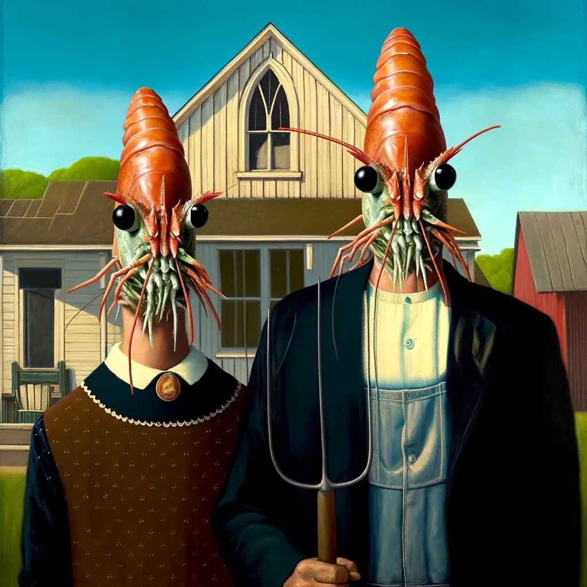
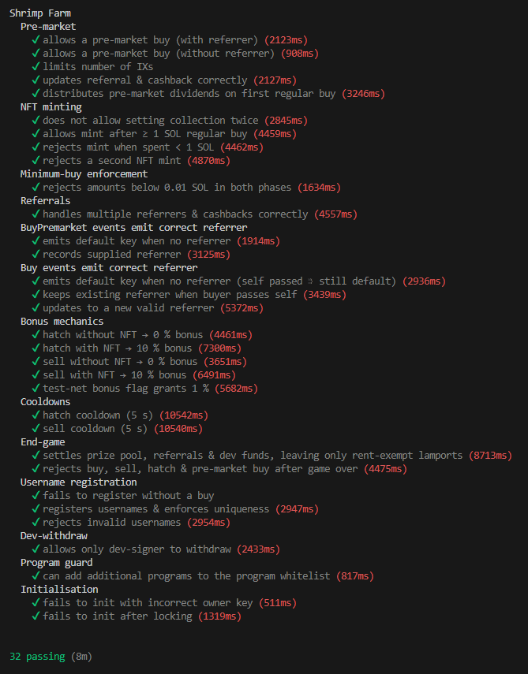

# Shrimp Farm
  

### Shrimp Farm is:
- A self-contained idle game on Solana, with NO token
- Open source and verified
- An art project with 1024 NFTs

## Links

Website:  
[https://shrimpfarm.fun](https://shrimpfarm.fun)  
Creator:  
[https://x.com/MrFwashere](https://x.com/MrFwashere)  
Docs:  
[https://github.com/mr-fahrenheit/shrimp-farm-docs](https://github.com/mr-fahrenheit/shrimp-farm-docs)  
Live Program:  
[https://solscan.io/account/23BCUPpfPkfCu6bmPCaLgyTR8UkruWeUnEyeC5shr1mp](https://solscan.io/account/23BCUPpfPkfCu6bmPCaLgyTR8UkruWeUnEyeC5shr1mp)

---

## Quickstart

```bash
# 1. Toolchain
curl -sSfL https://release.solana.com/stable/install | bash 
curl --proto '=https' --tlsv1.2 -sSf https://sh.rustup.rs | sh
npm i -g yarn 

# 2. Dependencies
cd shrimp-farm
yarn install 

# 3. Run the tests
anchor test
```


Expected output:


